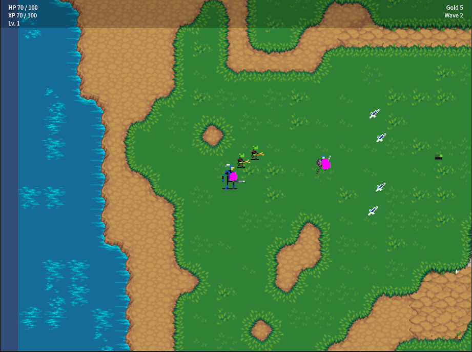
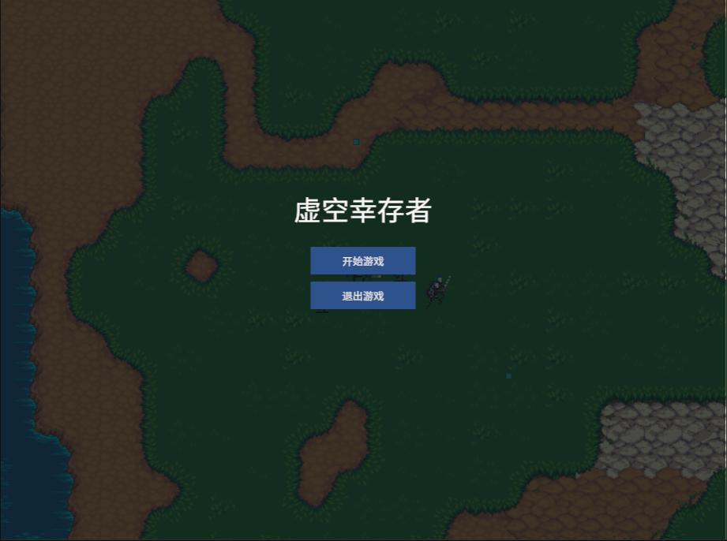
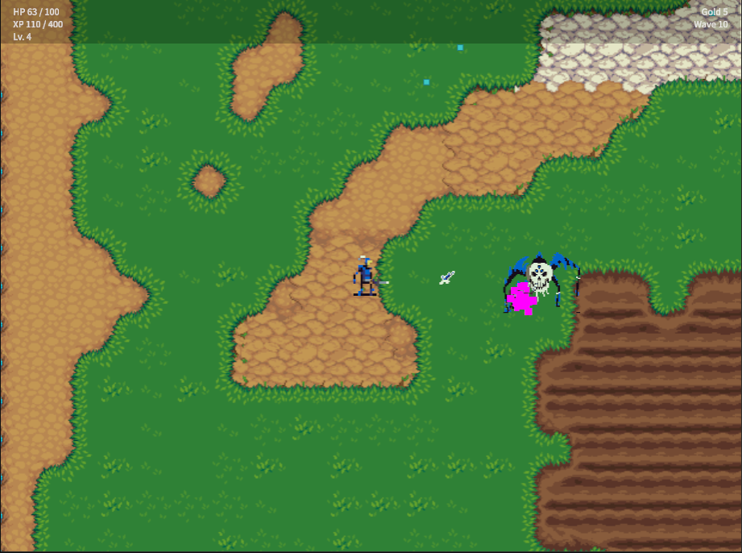
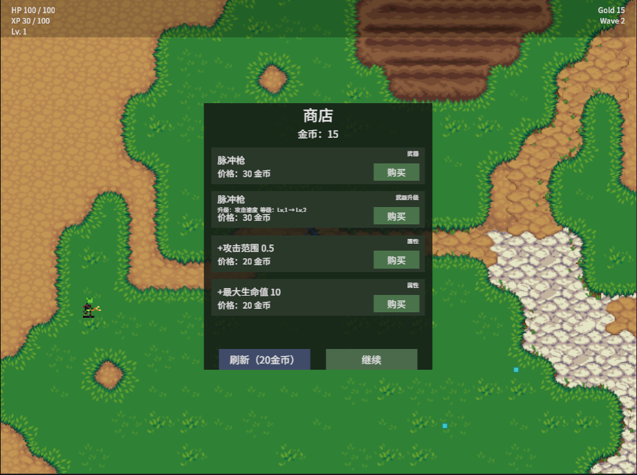
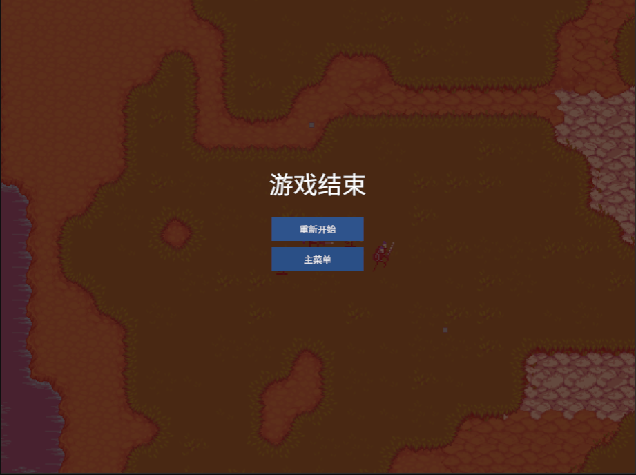

# Void Survivor / 虚空幸存者

> A 2D top-down arena roguelite built with Unity 6 — wave-based combat, multiple weapons, enemy archetypes, progression, shop, boss encounter, and persistent player data.



## Overview

Void Survivor is a 2D top-down arena survival shooter where the player is dropped into a closed arena and must survive 10 waves of increasingly dangerous enemy encounters, culminating in a single boss fight. The project is a portfolio-scale Unity 6 game built to demonstrate end-to-end gameplay engineering: data-driven configuration, a real game-state machine, an event-driven systems layer, an object pool, a wave manager, a roguelite upgrade + shop economy, and dual-platform release builds (Windows standalone and WebGL).

The codebase emphasizes clear system boundaries and single-responsibility scripts over content volume. Every system is independently testable through the project's probe discipline (temporary diagnostic scripts that are removed after verification), and the architecture is documented in `Docs/`.

## Gameplay

The core loop:

```
Enter arena
 → Fight enemies (auto-weapon + WASD movement)
 → Gain XP from kills
 → Level Up (choose one of three upgrades)
 → Spend Gold in the shop between waves
 → Survive 10 waves
 → Boss encounter (Wave 10)
 → Victory or Game Over
```

Combat is automatic for weapons — the player focuses on positioning, kiting, and timing. Between waves the player enters a shop and can buy new weapons, upgrade owned weapons, or purchase permanent stat bonuses.

## Features

- 10-wave survival progression with a dedicated W10 boss encounter
- 4 enemy archetypes (Chaser, Runner, Shooter, Tank) + 1 boss, all driven by `ScriptableObject` data
- 4 weapon types: Pulse Gun, Scatter Blaster, Boomerang, Arc Blade — each with distinct behavior
- XP / Level Up system with random 3-option upgrade chooser
- Shop system between waves (weapons, weapon upgrades, permanent stat bonuses, refresh)
- Victory / Game Over flow with restart and return-to-menu
- Persistent settings (Master / SFX volume) and best-run record (best wave / level / gold)
- Windows standalone build and WebGL build, both verified

## Screenshots

<table>
  <tr>
    <td></td>
    <td></td>
  </tr>
  <tr>
    <td></td>
    <td></td>
  </tr>
</table>

## Controls

| Action | Input |
|---|---|
| Move | WASD / Arrow keys |
| Attack | Automatic (no input required) |
| Pause | `Esc` |
| Navigate UI | Mouse |

All input is handled through Unity's new Input System. UI navigation uses the embedded `InputSystemUIInputModule`.

## Systems

| System | Responsibility |
|---|---|
| Game Flow | `GameManager` + `GameFlow` own the single `GameState` machine (MainMenu / Playing / Paused / LevelUp / Shop / GameOver / Victory) and validate legal transitions. |
| Player | `PlayerController` (movement, bounds clamp), `PlayerStats` (10 MVP stats), `PlayerHealth` (damage, regen, death → `PlayerDied`). |
| Weapons | `WeaponData` (ScriptableObject) + `WeaponController` (runtime equip, level, bonus) + `WeaponManager` (4 slots) + per-weapon behaviour classes (Pulse Gun / Scatter / Boomerang / Arc Blade). |
| Enemies | `EnemyData` (ScriptableObject) + `EnemyController` (shared runtime) + per-archetype AI (ChaserAI / RunnerAI / ShooterAI / TankAI / BossAI). |
| Wave System | `WaveManager` (10 waves, per-wave config, difficulty multiplier 1.00 → 1.45) + `EnemySpawner` (pooled spawn). |
| Roguelite | `PlayerProgress` (XP / Level / Gold) + `UpgradeData` (10 assets) + `UpgradeManager` + `LevelUpPanel`. |
| Shop | `ShopItemData` + `ShopManager` + `ShopPanel` (4 products per visit, refresh, continue). |
| Boss | `BossData` + `BossAI` (pursuit + contact damage + 3 s projectile skill) — W10 encounter. |
| Save | `SaveManager` (JsonUtility + `persistentDataPath`) + `BestRunRecorder` (terminal-state snapshot). |
| Audio / VFX | `AudioManager` + `SfxLibrary` + `GameplaySfx` + `VFXManager` (event-driven, no second framework). |
| UI | `MainMenuPanel` / `LevelUpPanel` / `ShopPanel` / `GameplayHUD` / `ResultPanel` (single Canvas, single EventSystem). |

## Technical Highlights

### Data-driven gameplay
Enemy stats, weapon stats, shop products, and upgrade values are all `ScriptableObject` assets. No enemy type or weapon requires code changes to tune — designers edit assets, code reads them. `EnemyStats` and `PlayerStats` are runtime read-only views that never mutate the underlying asset.

### Modular enemy archetypes
All five enemy types (Chaser, Runner, Shooter, Tank, Boss) share a single `EnemyController` base that resolves `Stats` / `Health` / `Body` / `Target` once in `Awake` / `Start`. Per-type AI composes on top — adding a new archetype means one new AI script + one new `EnemyData` asset + one new prefab variant, no core changes.

### Weapon architecture
Four weapons share a single `WeaponData` base class with distinct behaviour classes. `WeaponController` exposes `EffectiveDamage` / `EffectiveAttackCooldown` / `EffectiveRange` so the shop upgrade system can scale weapons at runtime without touching serialized data. `WeaponManager` owns 4 equip slots and rejects duplicate / over-capacity purchases.

### Centralized game state
A single `GameState` enum drives every UI panel and every simulation guard. `GameManager.TryChangeState` validates the transition against a legal-transition table — illegal transitions are rejected with a console warning. `EnemyController` / `WeaponController` freeze on `!GameplayActive`, which keeps MainMenu, GameOver, and Victory truly inert.

### Object pooling
`ObjectPool<T>` + `IPoolable` reused for `EnemyController` (per-prefab pools), `PulseProjectile` (shared), `BoomerangProjectile`, and `Pickup`. Pool instances survive Play/Stop and reset their per-spawn state — no allocation in the hot path.

### Event-driven integration
A type-safe generic `EventBus` is the only way cross-system signals (damage applied, enemy killed, item picked up, level up, game state changed) flow between systems. No system holds a direct reference to another system's UI or event surface.

### Persistent player data
`SaveManager` persists to `Application.persistentDataPath/VoidSurvivorSave.json` using `JsonUtility`. `BestRunRecorder` subscribes to `GameStateChanged` and snapshots the final run data (wave / level / gold) only on terminal transitions, writing only when a new high score is achieved. Settings (volume) and best-run record coexist in a single SaveData without overwriting each other.

### WebGL compatibility
- Build: Unity 6.3 LTS, IL2CPP scripting backend, Brotli-compressed assets (`WebGL.wasm.br` + `WebGL.data.br` + `WebGL.framework.js.br`).
- Persistence: `persistentDataPath` maps to the browser's IndexedDB on WebGL — settings and best-run record carry across browser sessions.
- Audio: WebAudio backend.
- The WebGL build has been validated for browser startup, IndexedDB initialization, WebAudio context creation, and stable in-process execution. Full end-to-end browser gameplay acceptance is still in the final acceptance pass.

## Project Structure

```text
VoidSurvivor/
├── Assets/
│   ├── Art/                       # Roguelike Dungeon + Kenney Desert Shooter Pack (see Credits)
│   ├── Prefabs/                  # Player, Enemies, Boss, Weapons
│   ├── Scenes/SC_Main.unity      # Single play scene (state machine)
│   ├── ScriptableObjects/         # EnemyData, WeaponData, ShopItemData, UpgradeData
│   └── Scripts/
│       ├── Core/                  # GameManager, GameFlow, GameBootstrap, EventBus, ObjectPool<T>
│       ├── Player/                # PlayerController, PlayerStats, PlayerHealth, PlayerAttack
│       ├── Enemy/                 # EnemyController, ChaserAI, RunnerAI, ShooterAI, TankAI, BossAI
│       ├── Weapons/               # WeaponController, WeaponManager, per-weapon behaviours
│       ├── Wave/                  # WaveManager, EnemySpawner
│       ├── Roguelite/             # PlayerProgress, UpgradeManager
│       ├── Shop/                  # ShopManager, ShopPanel
│       ├── UI/                    # MainMenu, LevelUp, GameplayHUD, ResultPanel
│       ├── Audio/                 # AudioManager, SfxLibrary, GameplaySfx
│       ├── VFX/                   # VFXManager
│       └── Save/                  # SaveManager, BestRunRecorder
├── Docs/                          # Design, architecture, task, save, decision, and known-issues docs
├── Screenshots/                   # Showcase screenshots (this README)
└── README.md                      # This file
```

## Build & Run

### Unity

- Unity **6000.3.21f1** (Unity 6.3 LTS)
- Open the project in Unity Hub → open `VoidSurvivor` → open the only build scene `Assets/Scenes/SC_Main.unity` → press Play.

### Windows

A verified Windows standalone build (Mono runtime, x64) is available locally at `D:\Work\UnityBuilds\VoidSurvivor\Windows\`. Public distribution of this build is not yet attached to this repository — the public download package will be added as part of the final showcase packaging.

### WebGL

A verified WebGL build is available locally at `D:\Work\UnityBuilds\VoidSurvivor\WebGL\`. Browser-side hosting and an online demo URL are part of the final showcase acceptance and are not yet attached to this repository.

## Development Status

Core gameplay systems, the Windows release build, and the WebGL release build are complete. GitHub showcase packaging and online WebGL deployment are the remaining showcase steps.

For detailed design and engineering documentation, see `Docs/`. The key entry points are:

- `Docs/PROJECT_CONTEXT.md` — what the project is and where it is
- `Docs/GAME_DESIGN.md` — game-design contract
- `Docs/ARCHITECTURE.md` — system architecture
- `Docs/DECISIONS.md` — engineering decisions and their reasoning

## Credits

This project uses third-party art assets. License information below reflects what is verifiable in the repository; any missing attribution should be confirmed manually before public distribution.

### Kenney — Desert Shooter Pack (1.0)
- Source: `Assets/Art/kenney_desert-shooter-pack_1.0/`
- License file: `Assets/Art/kenney_desert-shooter-pack_1.0/License.txt` is present in the repository and identifies the pack as **CC0 (Creative Commons Zero, Public Domain Dedication)**. Original creator: [Kenney](https://www.kenney.nl). Used for UI / interface tile art.

### Roguelike Dungeon — Asset Bundle
- Source: `Assets/Art/Roguelike Dungeon - Asset Bundle/`
- License: **NEEDS MANUAL CONFIRMATION.** No `License.txt`, `license.md`, `credits.txt`, or equivalent attribution file was found anywhere inside the asset bundle directory. Origin and license terms must be confirmed from the original source (Asset Store / itch.io / creator website) before public distribution.

## License

The project source code license has not been declared in the repository (no top-level `LICENSE` file). Treat the source as "all rights reserved" until an explicit license is added.
